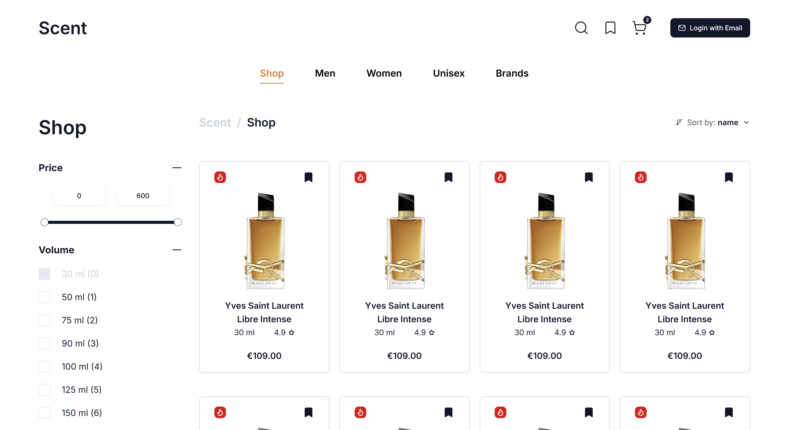
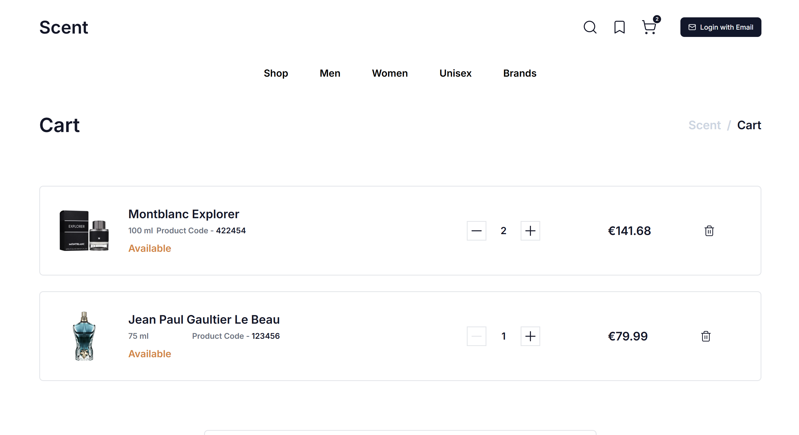
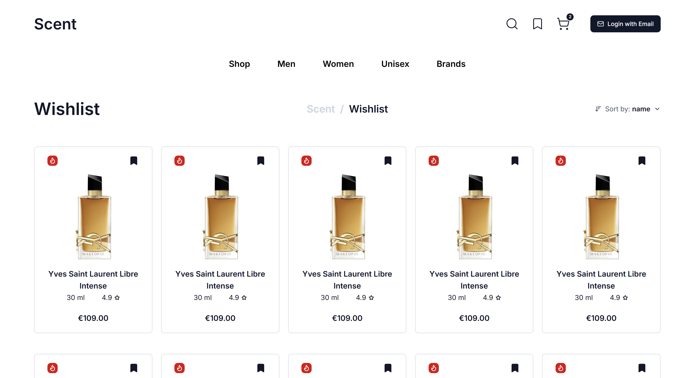

# Scent

Modern fragrance-focused e-commerce experience built with Next.js, TypeScript, and Tailwind CSS.


[](https://scent-nine.vercel.app/)


---

## Navigation
1. [Overview](#overview)
2. [Features](#features)
3. [Performance & Scalability Goals](#performance--scalability-goals)
4. [Roadmap](#roadmap)
5. [Tech Stack](#tech-stack)
6. [Project Structure](#project-structure)
7. [Getting Started](#getting-started)
8. [Available Scripts](#available-scripts)
9. [Screenshots](#screenshots)
10. [Deployment](#deployment)
11. [Contributing](#contributing)
12. [License](#license)

---

## Overview

Scent is a full-stack fragrance-focused e-commerce application developed collaboratively by a full-stack engineer and a UX/UI designer.

The project was created as a production-oriented portfolio application focused on delivering a modern shopping experience while following real-world frontend engineering practices.

Key areas of focus include:
- scalable architecture
- strict TypeScript usage
- reusable component design
- responsive layouts
- collaborative Git workflow
- performance optimization
- accessibility and user experience

---

## Features

- Fully responsive modern interface
- Accessible UI components
- Optimized Next.js App Router architecture
- Type-safe development with TypeScript
- Reusable component-based architecture
- Tailwind CSS design system
- Conventional Commits and structured PR workflow
- Production-oriented frontend workflow

---

## Performance & Scalability Goals

The application is designed with a production-oriented mindset, focusing on perceived performance, scalability, and resilience under real-world constraints such as high latency and increased user load.

The current performance objectives include:

- Optimized user experience under high-latency and unstable network conditions
- Efficient rendering strategy with minimal unnecessary client-side JavaScript
- Scalable architecture designed to support high traffic workloads (100k+ concurrent users) under appropriate horizontal scaling conditions.
- Reduced Time to First Byte (TTFB) and optimized server response times via caching strategies
- Optimized asset delivery (image optimization, lazy loading, and CDN usage)
- Stable UI performance under heavy interaction load (animations, cart updates, navigation transitions)

Additional engineering targets for production readiness:

- Effective caching strategy (server-side + edge where applicable)
- Database query optimization and avoidance of N+1 patterns
- Stateless backend design to support horizontal scaling
- Graceful degradation under partial service failure
- Monitoring-ready architecture (logs, metrics, and error tracking integration)
- Core Web Vitals optimization (LCP, CLS, INP within “good” thresholds)

---

## Roadmap

### Design
- [x] Website structure
- [x] Branding (color scheme, fonts, spacing)
- [x] Breakpoints definition
- [x] Desktop design — all pages and component states
- [ ] Tablet and mobile adaptive design
- [ ] Design polish and organization

---

### Phase 0 — Preparation
- [x] Complete official Next.js course
- [x] Learn Prisma, PostgreSQL, and relational databases
- [x] Learn NextAuth basics
- [x] Initialize Next.js + TypeScript + Tailwind CSS

### Phase 1 — Frontend
- [x] Integrate Shadcn UI
- [x] UI kit (custom colors, fonts, buttons, tags, breadcrumbs)
- [x] Reusable components (header, footer, product card, search, comments)
- [ ] All client-side pages
- [ ] Metadata (title, description, favicon)

### Phase 2 — Backend: Core
- [ ] Set up Prisma + PostgreSQL
- [ ] Design database schema
- [ ] Seed database with initial data
- [ ] Configure NextAuth
- [ ] Configure localization
- [ ] React Server Components
- [ ] Authentication
- [ ] User profile
- [ ] Shop (filters, sorting, search, gender/brand views)
- [ ] Product interactions (wishlist, cart, comments)

### Phase 3 — Backend: Integrations
- [ ] Newsletter subscription
- [ ] Stripe payment integration (test mode)
- [ ] Order storage
- [ ] React Server Components optimization

### Phase 4 — Admin Dashboard
- [ ] Authentication
- [ ] Dashboard home
- [ ] Products CRUD
- [ ] Orders management
- [ ] Users management

### Phase 5 — Polishing
- [ ] Tablet and mobile responsiveness
- [ ] SEO optimization
- [ ] PageSpeed Insights audit
- [ ] Unit and integration testing
- [ ] Production readiness review
- [ ] Secrets and environment variables audit

### Phase 6 — Deployment
- [ ] Configure Vercel environment variables
- [ ] Deploy to Vercel
- [ ] Custom domain setup

### Phase 7 — Showcase
- [ ] Finalize README
- [ ] Set repository public
- [ ] Post on LinkedIn and Dev.to

---

## Tech Stack

### Frontend

- React v19
- Next.js v16
- TypeScript v5
- Tailwind CSS v4

### UI & Component Libraries

- Shadcn/ui
- Radix UI
- Lucide React
- Swiper

### Backend & Infrastructure

- Prisma (ORM)
- PostgreSQL (database)
- Vercel (hosting & deployment)


### Tooling & Developer Experience

- pnpm (package manager)
- ESLint (linting)
- Prettier (code formatting)
---

## Project Structure

```txt
src/
├── app/                         
│   ├── account/                 # Account related pages
│   │   ├── cart/
│   │   ├── orders/
│   │   ├── profile/
│   │   ├── wishlist/
│   │   └── layout.tsx
│   ├── shop/                    # Shop related pages
│   │   ├── [[...slug]]/
│   │   ├── brands/
│   │   ├── product/
│   │   └── layout.tsx
│   ├── globals.css              # Global styles, themes, and utilities
│   ├── layout.tsx               # Root layout
│   └── page.tsx                 # Homepage
│
├── assets/                      # Fonts, images, icons 
│   ├── images/
│   └── fonts.ts 
├── components/                  # Reusable components
│   ├── ui/                      # UI primitives
│   ├── icons/                   # Custom icons
│   ├── layout/                  # Layout-related components
│   │   ├── footer.tsx
│   │   ├── header.tsx
│   │   └── nav.tsx
│   └── pages/                   # Page-specific components
├── hooks/                       # Custom React hooks
└── lib/                         # Shared utilities and types
    ├── data.ts
    ├── types.ts
    └── utils.ts 
```

---

## Getting Started

### Clone the repository

```bash
git clone https://github.com/Abviol/scent.git
```

### Copy variables from .env.example to .env

```bash
cp .env.example .env
```

### Install dependencies

```bash
pnpm install
```

### Start development server

```bash
pnpm dev
```

Open:

```txt
http://localhost:3000
```

---

## Available Scripts

### Development

```bash
pnpm dev
```

### Production build

```bash
pnpm build
```

### Start production server

```bash
pnpm start
```

### Lint code

```bash
pnpm lint
```

---

## Screenshots

### Home Page


### Shop Page



### Cart Page




### Wishlist Page


---

## Deployment

The application is deployed on Vercel automatically on push to `main`.

---

## Contributing

Please read [Contributing](./CONTRIBUTING.md) 
before creating branches, commits, or pull requests.

---

## License

MIT License.